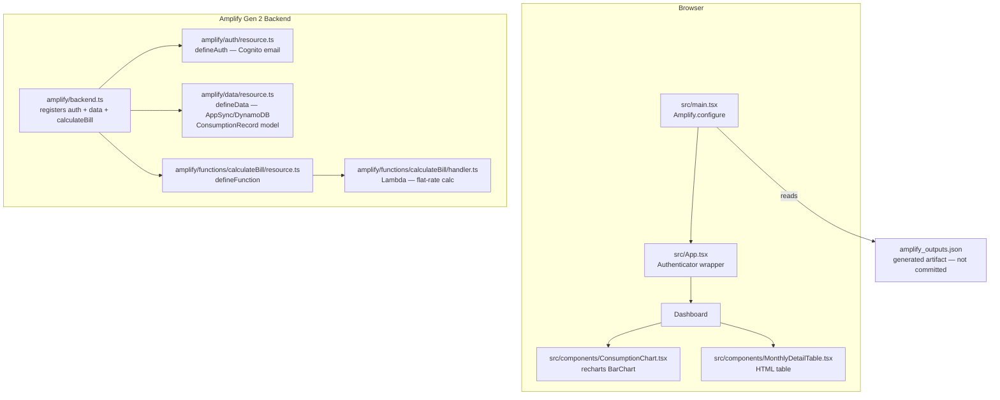
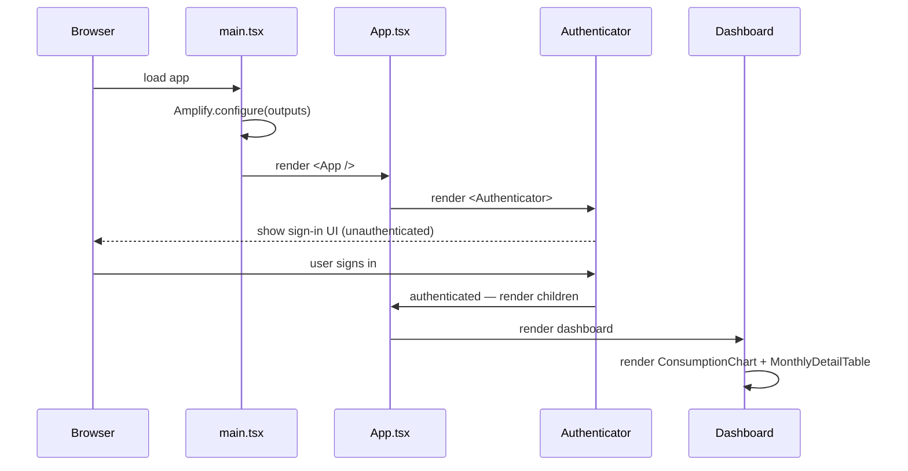
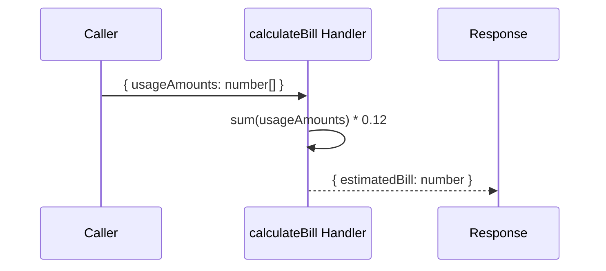

# Design Document: Project Initialization — Electrify! Plus

## Overview

This document describes the one-time scaffolding of the **Electrify! Plus** application: a React + Vite TypeScript frontend wired to an AWS Amplify Gen 2 backend (Cognito auth, AppSync/DynamoDB data, and a Lambda bill-calculator function). The three initialization tasks produce a fully runnable skeleton where authenticated users land on a dashboard containing placeholder chart and table components, and unauthenticated users are gated behind the Amplify-provided sign-in UI.

The design enforces the Electrify! Plus Architectural Rulebook throughout: `src/` contains only frontend code, `amplify/` contains only infrastructure definitions, and every dependency is pinned to an exact version to ensure reproducible builds.

## Architecture



## Sequence Diagrams

### Application Bootstrap Flow



### Bill Calculation Flow (Lambda)



## Components and Interfaces

### Component 1: `amplify/auth/resource.ts`

**Purpose**: Defines the Cognito User Pool with email/password sign-in.

**Interface**:
```typescript
import { defineAuth } from '@aws-amplify/backend';

export const auth = defineAuth({
  loginWith: {
    email: true,
  },
});
```

**Responsibilities**:
- Provision a Cognito User Pool scoped to email/password authentication.
- Expose the `auth` export for registration in `amplify/backend.ts`.

### Component 2: `amplify/data/resource.ts`

**Purpose**: Defines the single-table AppSync GraphQL + DynamoDB schema with the `ConsumptionRecord` model.

**Interface**:
```typescript
import { a, defineData, type ClientSchema } from '@aws-amplify/backend';

const schema = a.schema({
  ConsumptionRecord: a
    .model({
      customerId: a.string().required(),
      date: a.string().required(),       // ISO 8601, e.g. "2024-01-15"
      monthYear: a.string().required(),  // "YYYY-MM", e.g. "2024-01"
      kwhUsage: a.float().required(),
    })
    .authorization((allow) => [allow.owner()]),
});

export type Schema = ClientSchema<typeof schema>;

export const data = defineData({
  schema,
  authorizationModes: {
    defaultAuthorizationMode: 'userPool',
  },
});
```

**Responsibilities**:
- Define `ConsumptionRecord` with owner-based authorization.
- Use string types for `date` and `monthYear` to avoid DynamoDB date handling complexity.
- Expose `Schema` type and `data` export for registration in `amplify/backend.ts`.

**Data Model Field Specification**:

| Field | Type | Format | Notes |
|---|---|---|---|
| `id` | `string` | Auto-generated (ULID) | Managed by Amplify |
| `customerId` | `string` | Free-form | Required |
| `date` | `string` | ISO 8601 (`YYYY-MM-DD`) | Required |
| `monthYear` | `string` | `YYYY-MM` | Required |
| `kwhUsage` | `float` | Non-negative decimal | Required |

### Component 3: `amplify/functions/calculateBill/resource.ts`

**Purpose**: Declares the `calculateBill` Lambda function to Amplify Gen 2.

**Interface**:
```typescript
import { defineFunction } from '@aws-amplify/backend';

export const calculateBill = defineFunction({
  name: 'calculate-bill',
  entry: './handler.ts',
});
```

**Responsibilities**:
- Register the function name and entry point with Amplify.
- Expose `calculateBill` for registration in `amplify/backend.ts`.

### Component 4: `amplify/functions/calculateBill/handler.ts`

**Purpose**: Lambda handler implementing flat-rate bill calculation.

**Interface**:
```typescript
interface BillCalculatorInput {
  usageAmounts: number[];
}

interface BillCalculatorOutput {
  estimatedBill: number;
}

export const handler = async (event: BillCalculatorInput): Promise<BillCalculatorOutput>
```

**Flat-Rate Calculation**:

```
FLAT_RATE = 0.12  // USD per kWh

totalUsage   = sum(event.usageAmounts)
estimatedBill = totalUsage * FLAT_RATE
```

**Responsibilities**:
- Accept `{ usageAmounts: number[] }` as the Lambda event payload.
- Sum all values in `usageAmounts`.
- Multiply by `$0.12/kWh` flat rate.
- Return `{ estimatedBill: number }` rounded to two decimal places.
- Handle empty arrays by returning `{ estimatedBill: 0 }`.

### Component 5: `amplify/backend.ts`

**Purpose**: Root backend registration — wires auth, data, and Lambda function together.

**Interface**:
```typescript
import { defineBackend } from '@aws-amplify/backend';
import { auth } from './auth/resource';
import { data } from './data/resource';
import { calculateBill } from './functions/calculateBill/resource';

export const backend = defineBackend({
  auth,
  data,
  calculateBill,
});
```

**Responsibilities**:
- Import and register all backend resources.
- Act as the single entry point for Amplify Gen 2 backend synthesis.

### Component 6: `src/main.tsx`

**Purpose**: Application entry point — configures Amplify before any rendering.

**Interface**:
```typescript
import { Amplify } from 'aws-amplify';
import outputs from '../amplify_outputs.json';

Amplify.configure(outputs);
// ReactDOM.createRoot(...).render(<App />)
```

**Responsibilities**:
- Call `Amplify.configure(outputs)` as the first side effect before rendering.
- Mount the React tree into `#root`.

### Component 7: `src/App.tsx`

**Purpose**: Root React component — gates the entire dashboard behind `<Authenticator>`.

**Interface**:
```typescript
import { Authenticator, useAuthenticator } from '@aws-amplify/ui-react';

// Renders <Authenticator> wrapping the dashboard.
// Uses useAuthenticator() to expose { user, signOut }.
```

**Responsibilities**:
- Wrap all dashboard content in `<Authenticator>`.
- Provide `user` and `signOut` to child components via `useAuthenticator`.
- Unauthenticated users see only the Amplify sign-in/sign-up UI.

### Component 8: `src/components/ConsumptionChart.tsx`

**Purpose**: Placeholder 12-month consumption chart using `recharts`.

**Interface**:
```typescript
import { BarChart, Bar, XAxis, YAxis, CartesianGrid, Tooltip } from 'recharts';

// Renders a BarChart with static/mock data.
// Section title: "12-Month Consumption Chart"
```

**Responsibilities**:
- Render a `recharts` `BarChart` with mock/empty data.
- Display the section heading "12-Month Consumption Chart".
- No live data queries in this initialization phase.

### Component 9: `src/components/MonthlyDetailTable.tsx`

**Purpose**: Placeholder monthly detail table.

**Interface**:
```typescript
// Renders an HTML <table> with column headers.
// Columns: Month | kWh Usage | Estimated Bill
// Section title: "Monthly Detail Table"
```

**Responsibilities**:
- Render an HTML `<table>` with `<thead>` containing the three column headers.
- Display the section heading "Monthly Detail Table".
- No live data queries in this initialization phase.

## Data Models

### Model: `ConsumptionRecord`

```typescript
interface ConsumptionRecord {
  id: string;            // Auto-generated ULID
  customerId: string;    // Owner's customer identifier
  date: string;          // ISO 8601 date: "YYYY-MM-DD"
  monthYear: string;     // Billing period: "YYYY-MM"
  kwhUsage: number;      // Kilowatt-hours consumed (non-negative float)
  owner?: string;        // Injected by Amplify owner auth
}
```

**Validation Rules**:
- `customerId` must be a non-empty string.
- `date` must match the pattern `YYYY-MM-DD`.
- `monthYear` must match the pattern `YYYY-MM`.
- `kwhUsage` must be a non-negative finite number.

### Model: `BillCalculatorInput`

```typescript
interface BillCalculatorInput {
  usageAmounts: number[];  // Array of kWh readings; may be empty
}
```

**Validation Rules**:
- `usageAmounts` must be a valid array (including empty).
- Each element must be a finite non-negative number.

### Model: `BillCalculatorOutput`

```typescript
interface BillCalculatorOutput {
  estimatedBill: number;  // Total estimated bill in USD, rounded to 2 decimal places
}
```

## Key Functions with Formal Specifications

### Function 1: `handler` (Lambda bill calculator)

```typescript
export const handler = async (
  event: BillCalculatorInput
): Promise<BillCalculatorOutput>
```

**Preconditions**:
- `event.usageAmounts` is a defined array (possibly empty).
- Each element of `event.usageAmounts` is a finite non-negative number.

**Postconditions**:
- Returns `{ estimatedBill }` where `estimatedBill = round(sum(event.usageAmounts) * 0.12, 2)`.
- If `event.usageAmounts` is empty, `estimatedBill === 0`.
- `estimatedBill >= 0` always holds.
- The function does not mutate `event.usageAmounts`.

**Loop Invariants**:
- During accumulation: the running total equals the sum of all previously processed elements, each ≥ 0.

### Function 2: `Amplify.configure` call in `src/main.tsx`

```typescript
Amplify.configure(outputs)
```

**Preconditions**:
- `amplify_outputs.json` exists and is a valid Amplify Gen 2 outputs artifact.
- `Amplify.configure` is called before any `aws-amplify` API call or React render.

**Postconditions**:
- The Amplify client is initialized with the correct endpoints, region, and pool IDs.
- Subsequent `generateClient()` and auth calls resolve against the configured backend.

## Algorithmic Pseudocode

### Bill Calculation Algorithm

```pascal
ALGORITHM calculateEstimatedBill(usageAmounts)
INPUT:  usageAmounts: array of non-negative floats
OUTPUT: estimatedBill: non-negative float (USD, 2 decimal places)

CONST FLAT_RATE ← 0.12

BEGIN
  IF usageAmounts IS EMPTY THEN
    RETURN 0
  END IF

  totalKwh ← 0.0

  FOR EACH amount IN usageAmounts DO
    ASSERT amount >= 0
    totalKwh ← totalKwh + amount
  END FOR

  // Loop invariant: totalKwh = sum of all processed amounts, all >= 0

  estimatedBill ← ROUND(totalKwh * FLAT_RATE, 2)

  ASSERT estimatedBill >= 0

  RETURN estimatedBill
END
```

**Preconditions**:
- `usageAmounts` is a finite array; may be empty.
- All elements are non-negative finite floats.

**Postconditions**:
- Result equals `round(sum(usageAmounts) * 0.12, 2)`.
- Result is non-negative.

**Loop Invariants**:
- `totalKwh` equals the sum of all elements processed so far.
- `totalKwh >= 0` after every iteration.

### App Bootstrap Algorithm

```pascal
ALGORITHM bootstrapApp()
INPUT:  amplify_outputs.json (filesystem artifact)
OUTPUT: React tree mounted in DOM

BEGIN
  outputs ← import('../amplify_outputs.json')

  // MUST occur before any Amplify API call or React render
  Amplify.configure(outputs)

  root ← ReactDOM.createRoot(document.getElementById('root'))
  root.render(<App />)
END
```

**Preconditions**:
- `amplify_outputs.json` is present at build time.
- DOM element with id `"root"` exists in `index.html`.

**Postconditions**:
- Amplify is configured with correct backend parameters.
- React root is rendered; `<Authenticator>` is the first gating element.

## Example Usage

```typescript
// src/main.tsx — entry point
import React from 'react';
import ReactDOM from 'react-dom/client';
import { Amplify } from 'aws-amplify';
import outputs from '../amplify_outputs.json';
import App from './App';

Amplify.configure(outputs);

ReactDOM.createRoot(document.getElementById('root')!).render(
  <React.StrictMode>
    <App />
  </React.StrictMode>
);
```

```typescript
// src/App.tsx — authenticated shell
import { Authenticator, useAuthenticator } from '@aws-amplify/ui-react';
import '@aws-amplify/ui-react/styles.css';
import ConsumptionChart from './components/ConsumptionChart';
import MonthlyDetailTable from './components/MonthlyDetailTable';

function Dashboard() {
  const { user, signOut } = useAuthenticator();
  return (
    <div>
      <header>
        <span>Welcome, {user?.username}</span>
        <button onClick={signOut}>Sign Out</button>
      </header>
      <ConsumptionChart />
      <MonthlyDetailTable />
    </div>
  );
}

export default function App() {
  return (
    <Authenticator>
      <Dashboard />
    </Authenticator>
  );
}
```

```typescript
// amplify/functions/calculateBill/handler.ts
const FLAT_RATE = 0.12;

interface BillCalculatorInput { usageAmounts: number[]; }
interface BillCalculatorOutput { estimatedBill: number; }

export const handler = async (
  event: BillCalculatorInput
): Promise<BillCalculatorOutput> => {
  const total = (event.usageAmounts ?? []).reduce((sum, n) => sum + n, 0);
  const estimatedBill = Math.round(total * FLAT_RATE * 100) / 100;
  return { estimatedBill };
};
```

```typescript
// Example Lambda invocation
const result = await handler({ usageAmounts: [300, 450, 210] });
// result.estimatedBill === 115.20  (960 kWh × $0.12)

const empty = await handler({ usageAmounts: [] });
// empty.estimatedBill === 0
```

## Error Handling

### Error Scenario 1: Missing `amplify_outputs.json`

**Condition**: `amplify_outputs.json` does not exist at build time (e.g., `ampx sandbox` has never run).

**Response**: Vite build/dev server throws a module resolution error before any code runs.

**Recovery**: Developer must run `npx ampx sandbox` to generate `amplify_outputs.json`, then restart the dev server.

### Error Scenario 2: `Amplify.configure` called after Amplify API usage

**Condition**: Any Amplify API (auth, data client) is called before `Amplify.configure(outputs)` executes.

**Response**: Amplify client throws a runtime configuration error.

**Recovery**: Ensure `Amplify.configure(outputs)` is the first statement in `src/main.tsx`, before `ReactDOM.createRoot`.

### Error Scenario 3: Lambda receives invalid `usageAmounts`

**Condition**: `event.usageAmounts` is `undefined`, `null`, or contains non-numeric values.

**Response**: The handler defaults `usageAmounts` to `[]` via `?? []`, and `reduce` produces `0`. Non-numeric values that pass TypeScript's type-check at runtime will produce `NaN` in the sum.

**Recovery**: Input validation should be added in a future iteration; for initialization this is out of scope.

### Error Scenario 4: Unauthenticated access to dashboard

**Condition**: A user navigates to the app without being signed in.

**Response**: `<Authenticator>` intercepts rendering and displays the Amplify sign-in/sign-up UI instead of the dashboard.

**Recovery**: User completes sign-in or sign-up flow; `<Authenticator>` then renders children normally.

## Testing Strategy

### Unit Testing Approach

Focus on the `calculateBill` Lambda handler as it contains the only pure business logic.

Key test cases:
- Empty array → returns `{ estimatedBill: 0 }`
- Single value → `[100]` → `{ estimatedBill: 12.00 }`
- Multiple values → `[300, 450, 210]` → `{ estimatedBill: 115.20 }`
- Floating-point inputs → `[100.5, 99.5]` → `{ estimatedBill: 24.00 }`
- Rounding boundary → result is always rounded to 2 decimal places

### Property-Based Testing Approach

**Property Test Library**: `fast-check`

Property tests for the `calculateBill` handler:
- **Non-negativity**: For any array of non-negative numbers, `estimatedBill >= 0`.
- **Linearity**: `handler([a, b])` equals `handler([a]) + handler([b])` (within floating-point tolerance).
- **Scaling**: `handler(xs.map(x => x * k))` equals `handler(xs) * k` for any scalar `k >= 0`.
- **Empty array identity**: `handler([]) === 0` always.

### Integration Testing Approach

Integration tests (post-sandbox-deploy only, not part of initialization):
- Verify that Cognito User Pool is created and accepts email sign-up.
- Verify that AppSync schema deploys with `ConsumptionRecord` type accessible.
- Verify that Lambda function is invocable and returns the correct shape.

## Performance Considerations

- The `calculateBill` Lambda performs O(n) summation over `usageAmounts`. For typical billing data (≤ 12 monthly readings), performance is negligible.
- Placeholder frontend components render static data only; no API calls are made during initialization.
- `amplify_outputs.json` is a small JSON artifact imported at build time — no runtime network overhead.

## Security Considerations

- `amplify_outputs.json` contains public-facing Cognito pool IDs and AppSync endpoint URLs. It does **not** contain secrets. However, it should be excluded from source control (add to `.gitignore`) because it contains environment-specific values that change per deployment.
- `ConsumptionRecord` uses `allow.owner()` authorization — users can only read and write their own records. The `owner` field is injected automatically by Amplify.
- `defaultAuthorizationMode: 'userPool'` ensures all AppSync operations require a valid Cognito JWT; unauthenticated access is rejected at the API layer.
- The `calculateBill` Lambda does not store or log `usageAmounts`; it is a pure stateless computation.

## Dependencies

### Production Dependencies (frontend — pinned exact versions)

| Package | Purpose |
|---|---|
| `aws-amplify` | Amplify client SDK for auth/data |
| `@aws-amplify/ui-react` | `<Authenticator>` and UI components |
| `recharts` | `BarChart` and data visualization |

### Dev Dependencies (frontend — pinned exact versions)

| Package | Purpose |
|---|---|
| `@types/react` | TypeScript types for React |
| `@types/react-dom` | TypeScript types for ReactDOM |

### Backend Dependencies (via Amplify Gen 2)

| Package | Purpose |
|---|---|
| `@aws-amplify/backend` | `defineAuth`, `defineData`, `defineFunction`, `defineBackend` |
| `@aws-amplify/backend-cli` | `npx ampx sandbox` tooling |

### Generated Artifacts (not committed to source control)

| Artifact | Source | Purpose |
|---|---|---|
| `amplify_outputs.json` | `npx ampx sandbox` | Runtime configuration for Amplify client |

## Correctness Properties

*A property is a characteristic or behavior that should hold true across all valid executions of a system — essentially, a formal statement about what the system should do. Properties serve as the bridge between human-readable specifications and machine-verifiable correctness guarantees.*

### Property 1: Bill flat-rate correctness

*For any* non-empty array of non-negative numbers `usageAmounts`, the `estimatedBill` returned by `Bill_Handler` must equal `round(sum(usageAmounts) * 0.12, 2)` and must be non-negative.

**Validates: Requirements 5.4, 5.6**

### Property 2: Empty-array identity

*For any* invocation of `Bill_Handler` with an empty `usageAmounts` array, the `estimatedBill` must equal exactly `0`.

**Validates: Requirements 5.5**

### Property 3: Two-decimal rounding invariant

*For any* array of non-negative numbers `usageAmounts`, the `estimatedBill` returned by `Bill_Handler` must have at most two digits after the decimal point (i.e., `estimatedBill * 100` must be an integer within floating-point tolerance).

**Validates: Requirements 5.6**

### Property 4: Non-mutation of input array

*For any* array `usageAmounts`, after calling `Bill_Handler({ usageAmounts })`, the array must be identical in length and content to its state before the call.

**Validates: Requirements 5.8**

### Property 5: Authentication gate invariant

*For any* unauthenticated session state, the `<Authenticator>` component must render the sign-in UI and not render any Dashboard content; and for any authenticated session state, the Dashboard must be rendered inside the `<Authenticator>` boundary.

**Validates: Requirements 8.1, 8.2, 8.3**

### Property 6: ConsumptionChart structural completeness

*For any* render of `ConsumptionChart`, the output must contain both the section heading `"12-Month Consumption Chart"` and a `recharts` `BarChart` element.

**Validates: Requirements 9.2, 9.3**

### Property 7: MonthlyDetailTable structural completeness

*For any* render of `MonthlyDetailTable`, the output must contain the section heading `"Monthly Detail Table"`, an HTML `<table>` element, and `<th>` headers for `Month`, `kWh Usage`, and `Estimated Bill`.

**Validates: Requirements 10.2, 10.3, 10.4**

### Property 8: Directory boundary enforcement

*For any* file within `src/`, it must not contain imports resolving into the `amplify/` directory; and for any file within `amplify/`, it must not contain imports of React or UI framework modules.

**Validates: Requirements 11.3, 11.4**
